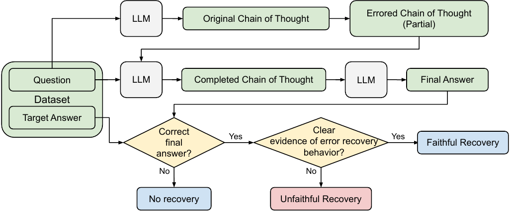

# Dissociation of Faithful and Unfaithful Reasoning in LLMs


=======
Project abstract:

> Large language models (LLMs) often improve their performance in downstream tasks when they generate Chain of Thought reasoning text before producing an answer. We investigate how LLMs recover from errors in Chain of Thought. Through analysis of error recovery behaviors, we find evidence for unfaithfulness in Chain of Thought, which occurs when models arrive at the correct answer despite invalid reasoning text. We identify factors that shift LLM recovery behavior: LLMs recover more frequently from obvious errors and in contexts that provide more evidence for the correct answer. Critically, these factors have divergent effects on faithful and unfaithful recoveries. Our results indicate that there are distinct mechanisms driving faithful and unfaithful error recoveries. Selective targeting of these mechanisms may be able to drive down the rate of unfaithful reasoning and improve model interpretability.

# Setup

## Requirements
Make sure you have Python >= 3.10 installed on your machine, and install the rest of our requirements as follows:
```
pip install -r requirements.txt
```

## OpenAI API key
Store your API keys as a environment variables.
```
export OPENAI_API_KEY=(YOUR OPENAI API KEY)
export CLAUDE_API_KEY=(YOUR ANTHROPIC APIKEY)
export TOGETHER_API_KEY=(YOUR TOGETHER AI API KEY)
```

## Clone datasets
Each of the following datasets should be cloned as siblings to this repository (Within the same parent directory as this repository):
- AWPS (MultiArith)
- ASDiv
- SVAMP
- GSM8K
```
git clone https://github.com/wangxr14/Algebraic-Word-Problem-Solver.git
git clone https://github.com/chaochun/nlu-asdiv-dataset.git
git clone https://github.com/arkilpatel/SVAMP.git
git clone https://github.com/openai/grade-school-math.git
```
(These commands should be run from outside the CoTErrorRecovery directory.)

# Replicating results
All code is present in the `code` directory of this repository. All python commands in this section assume to be run from within that directory.
```
cd CoTErrorRecovery/code
```

All prompting utilities and API calls to the APIs are handled in `api_call.py`. These evaluation utilities are combined in the `PromptModel` class in `prompt_model.py`. This evaluation framework could be extended to other LLMs/APIs by modifying those two files.

The evaluations and perturbations in our paper were performed with the fixed versions of GPT-4 (gpt-4-0314), Claude-3 (claude-3-opus-20240229), and Llama-3 70B Chat (meta-llama/Llama-3-70b-chat-hf on the Together AI API). For conciseness, we give example commands here for GPT-4 only, but all commands can be adapted to other models by passing in the appropriate model name (e.g. "gpt-3.5-turbo-0301") to the `--model` argument. (See `api_call.py` for details)

To re-run our results from scratch, delete all of the CSV and JSON files from the `results` directory. Because of randomness in some of the perturbations (i.e. Experiment 1 and Experiment 3) as well as non-determinism from the OpenAI API, replicated responses may not exactly match the results we recorded. Additionally,[OpenAI has announced](https://openai.com/blog/function-calling-and-other-api-updates) that access to the March 2023 versions of GPT-3.5 and GPT-4 may be permanently deprecated as early as June 2024.

## Original chain of thought
```
python evaluate_awps.py --model gpt-4-0314
python evaluate_asdiv.py --model gpt-4-0314
python evaluate_svamp.py --model gpt-4-0314
python evaluate_gsm8k.py --model gpt-4-0314
```
Each evaluation call records a single CSV to the corresponding dataset folder in the `results` directory. The CSV's name corresponds to the name of the datafile in the original dataset directory.

For example, `results/awps/MultiArith.csv` contains the original chain of thought responses to the MultiArith dataset of the AWPS repository.

## Generate numerical perturbations
Copy error
```
python number_intervention.py --model gpt-4-0314 --position copy --data awps
python number_intervention.py --model gpt-4-0314 --position copy --data asdiv
python number_intervention.py --model gpt-4-0314 --position copy --data svamp
python number_intervention.py --model gpt-4-0314 --position copy --data gsm8k
```
Calculation error
```
python number_intervention.py --model gpt-4-0314 --position calc --data awps
python number_intervention.py --model gpt-4-0314 --position calc --data asdiv
python number_intervention.py --model gpt-4-0314 --position calc --data svamp
python number_intervention.py --model gpt-4-0314 --position calc --data gsm8k
```
Propagated Calculation error
```
python number_intervention.py --model gpt-4-0314 --position propcalc --data awps
python number_intervention.py --model gpt-4-0314 --position propcalc --data asdiv
python number_intervention.py --model gpt-4-0314 --position propcalc --data svamp
python number_intervention.py --model gpt-4-0314 --position propcalc --data gsm8k
```
Error magnitude is specified in the `--perturbation` argument. The default behavior (`--perturbation random`) adjusts values by a random non-zero integer between -3 and 3, as used for Experiment 1 in our paper. To generate the perturbed chains of thought for Experiment 2, add `--perturbation add1_add101` to each of the commands above.

Each call creates a single JSON file within the corresponding dataset folder in the `results` directory. The file's name is structured as follows: `{datafile}_adjusted_position-{position}_perturbation-{perturbation}_{model}.json`.

For example, the perturbed chains of thought for GPT-4 on MultiArith with copying errors of random magnitude are stored at: `results/awps/MultiArith_adjusted_position-copy_perturbation-random_gpt-4-0314.json`.

## Add text noise
Text noise was added to each of the Experiment 1 results.

Copy error
```
python letter_intervention.py --model gpt-4-0314 --data awps --taskset MultiArith_adjusted_position-copy_perturbation-random
python letter_intervention.py --model gpt-4-0314 --data asdiv --taskset ASDiv_adjusted_position-copy_perturbation-random
python letter_intervention.py --model gpt-4-0314 --data svamp --taskset SVAMP_adjusted_position-copy_perturbation-random
python letter_intervention.py --model gpt-4-0314 --data gsm8k --taskset test_adjusted_position-copy_perturbation-random
```
Calculation error
```
python letter_intervention.py --model gpt-4-0314 --data awps --taskset MultiArith_adjusted_position-calc_perturbation-random
python letter_intervention.py --model gpt-4-0314 --data asdiv --taskset ASDiv_adjusted_position-calc_perturbation-random
python letter_intervention.py --model gpt-4-0314 --data svamp --taskset SVAMP_adjusted_position-calc_perturbation-random
python letter_intervention.py --model gpt-4-0314 --data gsm8k --taskset test_adjusted_position-calc_perturbation-random
```
Propagated Calculation error
```
python letter_intervention.py --model gpt-4-0314 --data awps --taskset MultiArith_adjusted_position-propcalc_perturbation-random
python letter_intervention.py --model gpt-4-0314 --data asdiv --taskset ASDiv_adjusted_position-propcalc_perturbation-random
python letter_intervention.py --model gpt-4-0314 --data svamp --taskset SVAMP_adjusted_position-propcalc_perturbation-random
python letter_intervention.py --model gpt-4-0314 --data gsm8k --taskset test_adjusted_position-propcalc_perturbation-random
```

Each call creates a single JSON file within the corresponding dataset folder in the `results` directory. The file's name is structured as follows: `{datafile}_adjusted_position-{position}_perturbation-{numerical perturbation}_letter_perturbation-typo10_{model}.json`.

For example, the noisy chains of thought for GPT-4 on MultiArith with copying errors of random magnitude are stored at: `results/awps/MultiArith_adjusted_position-copy_perturbation-random_letter_perturbation-typo10_gpt-4-0314.json`.

## Evaluate with perturbed chain of thought
The evaluation protocol is the same as for [the original chain of thought](#original-chain-of-thought), except with the addition of the argument `--tasket`, which specifies the JSON file containing the perturbed chain of thought as generated by the [numerical perturbation](#generate-numerical-perturbations) and/or [noise introduction](#add-text-noise) scripts. (This argument does not include the model name.)

For example, to evaluate GPT-4 on MultiArith with copying errors of random magnitude:
```
python evaluate_awps.py --model gpt-4-0314 --taskset MultiArith_adjusted_position-copy_perturbation-random
```

Each evaluation call records a single CSV to the corresponding dataset folder in the `results` directory. The CSV's name corresponds to the name of the perturbed source JSON (excluding the model name).

For example, `results/awps/MultiArith_adjusted_position-copy_perturbation-random.csv` contains the error recovery responses from the example call.

The files for which we have already performed manual annotation are marked with the suffix `_annotated`. These have the same content as the original CSV files (as generated in this step), but with the addition of a few final columns containing annotation information.

# Citation
```
@inproceedings{
yee2024faithful,
title={Faithful and Unfaithful Error Recovery in Chain of Thought},
author={Evelyn Yee and Alice Li and Chenyu Tang and Yeon Ho Jung and Ramamohan Paturi and Leon Bergen},
booktitle={First Conference on Language Modeling},
year={2024},
url={https://openreview.net/forum?id=IPZ28ZqD4I}
}
```